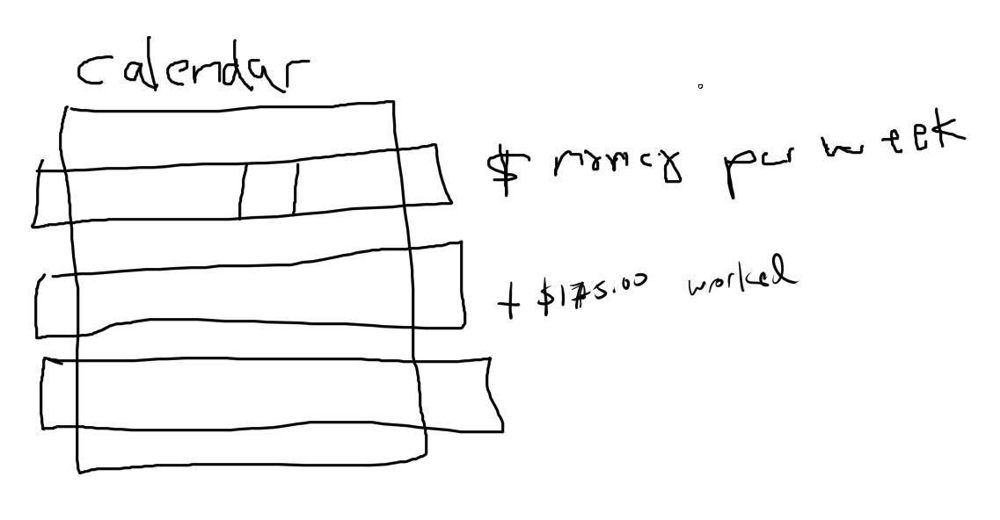
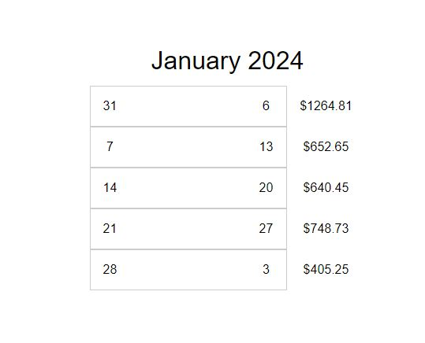

- [ ] accept data eg. bills
- [ ] render basic calendar block thing
- [ ] actually deal with data/sift
- [ ] add worked/plus money (dopamine hit)

### 01/11/2024

7:01 PM

So yeah right now I don't make enough to pay all my bills, I used to be a six-fig remote boy but now I'm a poor warehouse boy

This interface is something I designed a long time ago, where it shows you how much money you need per week.

Right now my warehouse job pays me every week so it works out too.

It's a modified calendar pretty much, although I made the calendar, I [made one a long time ago](http://cunninghamwebdd.com/projects/web-application/calendar/) actually with PHP one of my first projects

I am distracted... fatal mistake is turning on YouTube first thing when I get home, music is okay but YouTube just takes my attention away

There is this annoying high-pitch smoke-alarm sound that started a couple days ago and it's still going... I don't know why/what it is, it's outside of my building far away

I don't have the calendar right now/too spent, just want to make some structure/div

7:10 PM

It has also been a bit since I wrote some web app code, been working on the pi zero camera project

My fingers hurt

7:24 PM

It's funny like I'm not an entrepreneur/businessman... I have a lot of skills and yet I am worthless

I don't know how to create value, I also don't want to be a scammy guy though too so some things I won't do just because

I'm torn between boundless optimism (sky's the limit) and harsh reality (poor/unable to escape)

I would just forget my place... $50/hr would come to me with my highest salary job and yeah... the positive right now is I'm no longer supporting people, it's just me

I've been in debt for 13 years it's crazy... never hit 0. That's what I want, freedom... then get the ranch where I can tinker.

I have to feel like I achieved something before I go back to my current dumbass reality of putting things into a shelf or moving boxes around. My brain is stuck/locked until that 10-hr shift ends since I can't listen to music/do anything except that job.

I can't complain, I've been lucky, life has been handed to me several times and again I was a dumbass.

But I am still glad of the outcome where I stopped something I didn't like (last two jobs I had).

I could just coast but I also just hated it too so yeah idk...

Time would just pass me by... months... now I'm present, I'm here counting the days

I won't be able to do software engineering as a job long term because it ends up the same, I get bored of it and quit or get fired. I am also a mid/average developer and I'm alright with that, low self-esteem and what not.

Money is funny this digital thing, there's mountains of it out there, suddenly it's in your bank, wow! Amazing. How do I do that?

Alright I hav 30 minutes to write some basic front end code to show the visual concept of this thing

Right now I have a home, car, electricity/internet... life is fine (but it can be better, Wonderwoman meme)

Even missing credit card payments/shifting them forward... I can get by... but yeah. The main issue is I'm stuck/can't be free. Even a six fig job takes a long time due to taxes to pay off debt.

7:47 PM

This is the idea, though more bold/thicker lines

